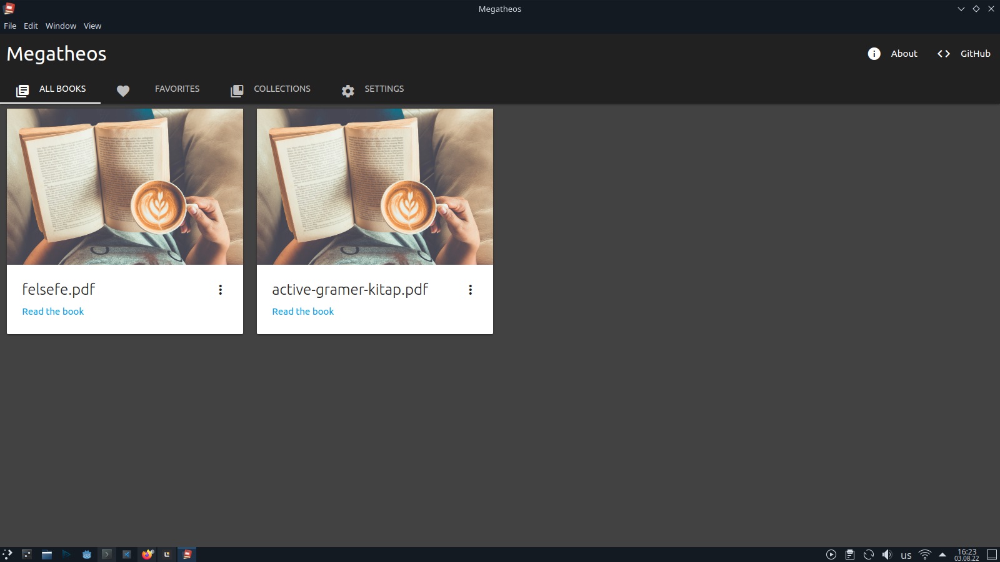

#  Megatheos
| Simple book reading app

[All Screenshots](./screenshots)

### Some functions:
* All the books you have read before (`All Books` tab)
* Change book author
* Mark the book as finished
* Add the book to `Favorites`
* Collections
* Settings

#### Tested on Linux (Ubuntu 22.04)
