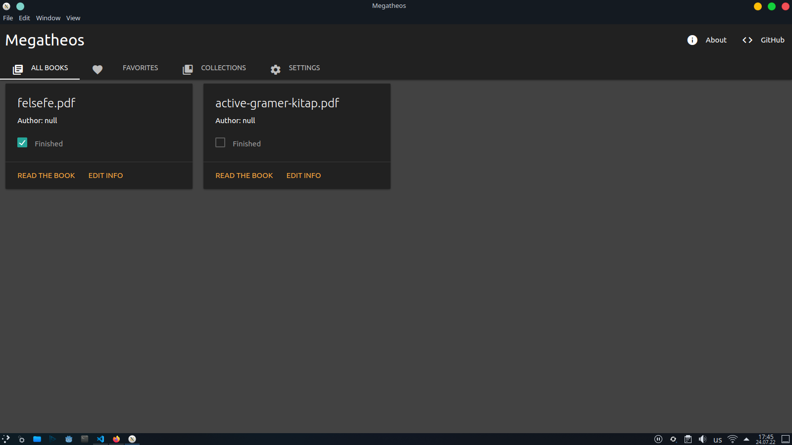

#  Megatheos
| Simple book reading app

### Some functions:
* All the books you have read before (`All Books` tab)
* Mark the book as finished
* Add the book to `Favorites`

### Expected new functions:
* Customization settings
* Creating Collections

#### Only tested on Linux